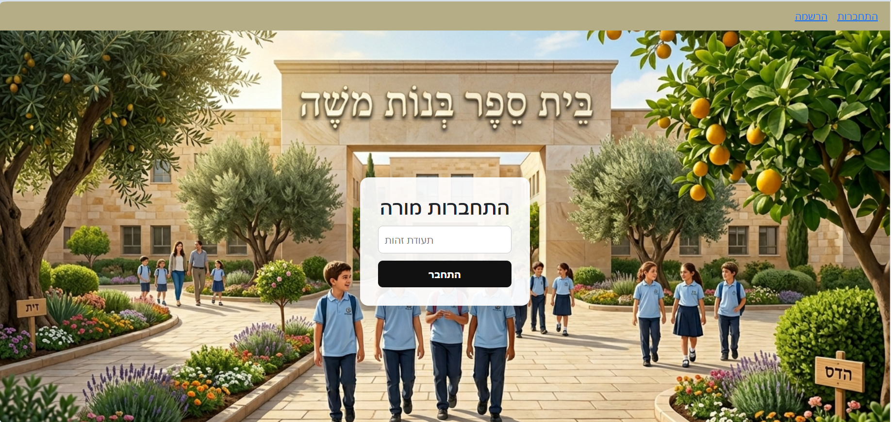
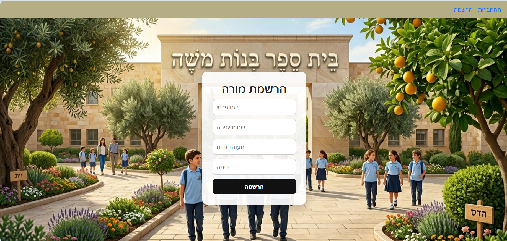
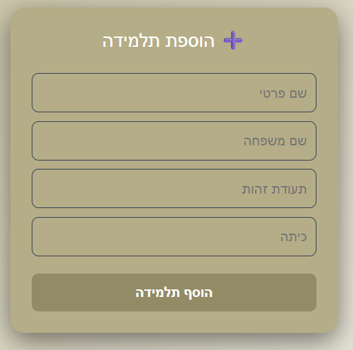
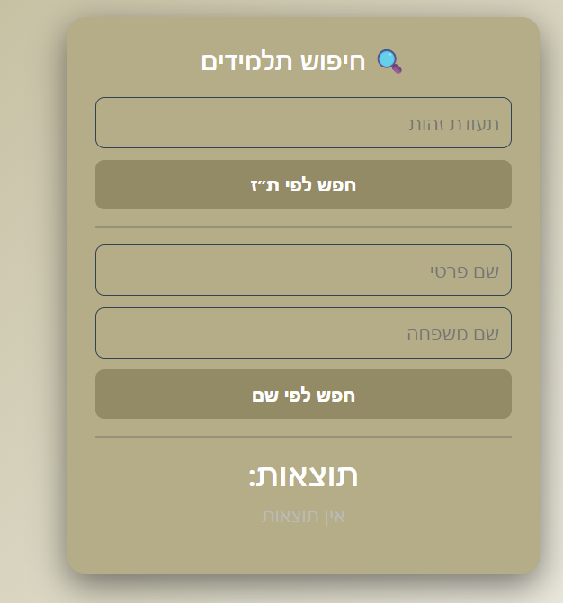
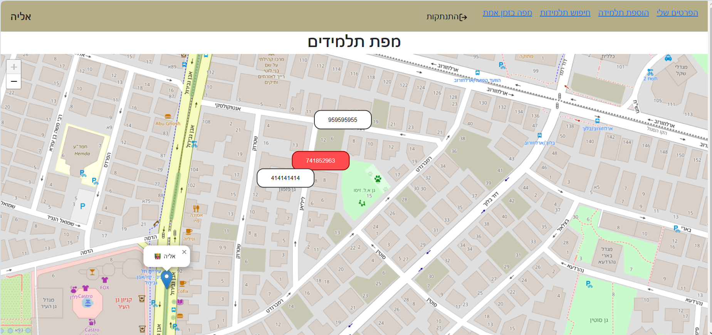

# Student Tracker

A system for managing and tracking students in real time for teachers.

The application allows teachers to register, log in, view their students, and track their locations in real time, including alerts when students move away.

---

## Project Description

Student Tracker is a full-stack application designed for teachers only.

After logging into the system, a teacher can:
- View their list of students
- Add new students
- Search for students by name or ID
- View an interactive map with student locations
- Receive alerts when a student moves beyond a defined distance

---

## User Roles

The system is designed for a single type of user:
- Teachers

Only authenticated teachers can access the system and perform actions.

---

## Main Features

- Teacher registration and login
- Viewing students by teacher
- Adding new students
- Searching students by ID or name
- Real-time map display
- Automatic location updates
- Alerts when students move away
- Dynamic color indication on the map

---

## Map System

The map displays the teacher and their students in real time.

### System Behavior:
- Locations are updated automatically every few seconds
- Each student is displayed with a custom info card
- When a student moves beyond the defined range:
  - An alert is triggered
  - The student's marker changes color (e.g., red)

---

## Usage

### Steps:

1. Register as a teacher
2. Log in
3. Access the dashboard
4. View students
5. Add a new student
6. Search for students
7. View the map

Screenshots to include:
- Login screen
- Registration screen
- Dashboard
- Add student
- Search students
- Map view

---

## Technologies

### Frontend:
- React
- Redux
- React Router
- React Leaflet

### Backend:
- Node.js
- Express

### Database:
- MongoDB

### Additional Libraries:
- Axios
- CORS
- Body Parser
- Nodemon
- Immer

---

## Installation and Setup

### Install dependencies

Client:
```bash
npm install
npm install react-leaflet@4 leaflet@1.9.4
Server:

npm install
Running the Project

Frontend:

npm start

Backend:

npm start

(The server also uses Nodemon for development)

Additional Configuration

Make sure to configure your MongoDB connection string in the server.

Future Improvements
Add multiple user roles
Replace polling with WebSockets for real-time updates
Improve UI/UX
Add advanced authentication (JWT with permissions)
Summary

This project demonstrates full-stack development using:

React (frontend)
Node.js and Express (backend)
MongoDB (database)

It also includes real-time data handling, map integration, and state management.
```md
## Screenshots

### Login


### Register


### Add Student


### Search Student


### Map View

